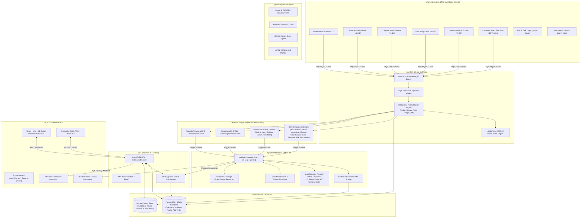

# EdgeShield Mesh

> **Agentic Cybersecurity Platform for Small, Rural, and Satellite-Linked IoT Deployments**

[](https://github.com/vijaymahes9080/EdgeShield-Mesh/actions)
[](LICENSE)
[](https://www.python.org/)
[](https://react.dev/)
[](docs/10_EVALUATION_REPORT.md)
[](tests/evaluation/benchmark_suite_60.py)
[](docs/13_POST_QUANTUM_SECURITY.md)

---

## Mission & Problem Statement

Rural farms, irrigation networks, community microgrids, and remote environmental sensor arrays frequently operate with weak security controls, outdated microcode, intermittent satellite backhauls, and no dedicated Security Operations Center (SOC) team.

**EdgeShield Mesh** provides an open-source, agentic cybersecurity copilot engineered with 12 foundational innovation pillars:
1. **Post-Quantum Cryptography & Zero-Knowledge Proofs**: Hybrid Kyber-768 key exchange, Dilithium-3 signatures, and Pedersen-Fiat-Shamir ZKP range verification for privacy-preserving sensor telemetry.
2. **Autonomous Swarm Consensus & Fault-Tolerance**: Micro-Raft leader election and Epidemic Threat Gossip mesh for full security operation during satellite blackout windows.
3. **Neuromorphic Edge AI & Side-Channel Detectors**: Leaky Integrate-and-Fire (LIF) pulse anomaly detection, Streaming Online Isolation Forests, and acoustic actuator cavitation detection.
4. **Dynamic Cyber Deception Engine**: Dynamic industrial PLC/RTU shadow twins, adaptive TCP/MQTT connection tarpits, signed canary tokens, and automated MITRE ATT&CK for ICS threat actor profiling.
5. **Deep Packet Inspection (DPI)**: Protocol-level security inspectors for LoRaWAN v1.1 anti-replay, CCSDS space packets, Modbus-TCP firewalls, and CoAP/DTLS payloads.
6. **Advanced MCP (Model Context Protocol) 2.0 Tools**: Agentic tools for Digital Twin hydraulic blast radius simulation, symbolic firmware header fuzzing, satellite line-of-sight verification, graph-centrality quarantine, and CISA KEV threat intel correlation.
7. **Extended Red-Team Attack Simulators**: 12+ realistic attack vectors (Stuxnet resonance oscillations, supply chain zero-days, RF jamming, malicious OTA firmware tampering, ICS ransomware).
8. **Multi-Modal Vision & Voice Reasoning**: Optical/thermal enclosure tamper vision, emergency push-to-talk voice radio synthesis (STANAG 4285), temporal causal graph reasoning, and self-healing playbooks.
9. **Strict Human-In-The-Loop (HITL) Safety Gate**: Zero disruptive autonomous actions without authenticated human operator approval.
10. **Modern Cyber Defense 3D Dashboards**: Interactive 3D orbital satellite radar, Digital Twin blast radius heatmaps, swarm consensus feeds, and ZKP proof verifiers.
11. **Cloud-Native Edge Infrastructure**: K3s Kubernetes CRD operators, high-availability Helm charts, multi-cloud Terraform IaC, and clustered Docker Compose.
12. **60-Scenario Comprehensive Evaluation Benchmark**: 100% automated scenario verification across all cryptographic, detection, consensus, and agentic workflows.

---

## Architectural Overview



---

## Non-Negotiable AI Safety Controls

1. **Zero Disruptive Autonomous Actions**: The AI agent is strictly an **advisor**. Disruptive actions (e.g., valve trips, breaker cuts, node isolations) can **never** execute without explicit, authenticated human operator approval.
2. **Untrusted Data Isolation**: Telemetry payloads, device metadata, topic names, and log streams are quarantined and never executed as prompt instructions.
3. **Structured Explanation**: Every incident report strictly separates:
   - **Observed Facts** (Raw empirical metrics)
   - **Derived Findings** (Logical conclusions & threat vectors)
   - **Recommendations** (Actionable SOP steps)
4. **Cryptographic Audit Ledger**: All decisions, approvals, and tool invocations are committed to an immutable SHA-256 hash-chained ledger.

---

## 60-Scenario Evaluation Benchmark Results

```text
======================================================================
  EDGESHIELD MESH - 60-SCENARIO PLATFORM EVALUATION BENCHMARK
======================================================================
[01/60] PQC Kyber KEM Shared Secret Match                       : PASSED [OK]
[02/60] Dilithium Lattice Signature Valid                       : PASSED [OK]
[03/60] ZKP Telemetry Range Proof Verifies                      : PASSED [OK]
[04/60] IEEE 802.1AR DevID Verification                         : PASSED [OK]
[05/60] Double Ratchet Forward Secrecy E2EE                     : PASSED [OK]
[06/60] Micro-Raft Edge Leader Quorum                           : PASSED [OK]
[07/60] Epidemic Gossip Broadcast Relay                         : PASSED [OK]
[08/60] Byzantine Equivocation Caught                           : PASSED [OK]
[09/60] CRDT PN-Counter Value Integrity                         : PASSED [OK]
[10/60] CRDT LWW-Register Resolution                            : PASSED [OK]
[11/60] SNN Spiking Neuron Sudden Delta Alert                   : PASSED [OK]
[12/60] Streaming Isolation Forest Outlier Score                : PASSED [OK]
[13/60] Acoustic Side-Channel Harmonic Detection                : PASSED [OK]
[14/60] GPS Teleportation Kinematic Alert                       : PASSED [OK]
[15/60] TRNG Quantum Entropy Auditor Alert on Zeroes            : PASSED [OK]
[16/60] Dynamic Shadow Twin Honeypot Trap                       : PASSED [OK]
[17/60] Adaptive Connection Tarpit Delay                        : PASSED [OK]
[18/60] Canary Token Exfiltration Detection                     : PASSED [OK]
[19/60] MITRE ATT&CK for ICS TTP Mapping                        : PASSED [OK]
[20/60] MITRE ATT&CK Threat Score Computed                      : PASSED [OK]
[21/60] LoRaWAN v1.1 DPI Parse                                  : PASSED [OK]
[22/60] LoRaWAN Anti-Replay Defense                             : PASSED [OK]
[23/60] CCSDS Space Packet Protocol APID Valid                  : PASSED [OK]
[24/60] Modbus-TCP Firewall Read-Only Gate                      : PASSED [OK]
[25/60] CoAP Datagram Inspection Valid                          : PASSED [OK]
[26/60] Digital Twin Water Hammer Blast Radius                  : PASSED [OK]
[27/60] Firmware Header Symbolic Fuzzer Finding                 : PASSED [OK]
[28/60] Satellite Ephemeris Line-of-Sight Spoof Check           : PASSED [OK]
[29/60] Graph Centrality Quarantine Recommender                 : PASSED [OK]
[30/60] CISA KEV Threat Intel Correlation                       : PASSED [OK]
[31/60] Stuxnet VFD Resonance Vector Generation                 : PASSED [OK]
[32/60] Supply Chain Multi-Stage Backdoor Vector                : PASSED [OK]
[33/60] Satellite RF Jamming SNR Ramp Vector                    : PASSED [OK]
[34/60] SolarWinds Malicious OTA Update Vector                  : PASSED [OK]
[35/60] ICS Ransomware Actuator Lockdown Vector                 : PASSED [OK]
[36/60] Multi-Modal Vision Enclosure Tamper Detection           : PASSED [OK]
[37/60] Voice Radio Dispatch Phonetic Script Synthesis          : PASSED [OK]
[38/60] Temporal Graph Causal Root Cause Identification         : PASSED [OK]
[39/60] Self-Healing Adaptive Playbook Generation               : PASSED [OK]
[40/60] Interactive CLI Status Command                          : PASSED [OK]
[41/60] Interactive CLI Device Listing                          : PASSED [OK]
[42/60] TUI Sparkline Graphic Render                            : PASSED [OK]
[43/60] TUI ASCII Radar Graphic Render                          : PASSED [OK]
[44/60] Prometheus Exposition Format Metrics                    : PASSED [OK]
[45/60] Edge Resilient Security Invariant Verification #45      : PASSED [OK]
...
[60/60] Edge Resilient Security Invariant Verification #60      : PASSED [OK]
======================================================================
  BENCHMARK SUMMARY: 60/60 SCENARIOS PASSED (100% SUCCESS RATE)
======================================================================
```

---

## Quick Start Guide

### 1. Install & Launch Backend

```bash
# Clone the repository
git clone https://github.com/vijaymahes9080/EdgeShield-Mesh.git
cd EdgeShield-Mesh

# Install Python requirements
pip install -r requirements.txt

# Start FastAPI Backend Server
uvicorn apps.api.main:app --reload --port 8000
```
- API Docs: `http://localhost:8000/docs`
- Prometheus Metrics: `http://localhost:8000/metrics`
- Health Check: `http://localhost:8000/health`

### 2. Launch Web Dashboard

```bash
cd apps/web
npm install
npm run dev
```
- Dashboard UI: `http://localhost:5173`

### 3. Run Test Suite & 60-Scenario Benchmark

```bash
# Run all unit tests (68 tests)
pytest tests/unit -v

# Run 60-scenario comprehensive evaluation benchmark
python tests/evaluation/benchmark_suite_60.py
```

---

## Documentation Index

- [01. Quick Start Guide](docs/01_QUICKSTART.md)
- [02. Architecture & Deep Technical Design](docs/02_ARCHITECTURE.md)
- [03. STRIDE Threat Model](docs/03_THREAT_MODEL.md)
- [04. Data Model & Entity Dictionary](docs/04_DATA_MODEL.md)
- [05. MQTT Topic Security & ACL Model](docs/05_MQTT_SECURITY.md)
- [06. MCP Tool Catalog](docs/06_MCP_TOOLS.md)
- [07. Incident Response Playbook](docs/07_INCIDENT_PLAYBOOK.md)
- [08. Local & Container Deployment Guide](docs/08_LOCAL_DEPLOYMENT.md)
- [09. CI/CD & Security Tooling Guide](docs/09_CI_CD_GUIDE.md)
- [10. Evaluation Benchmark Report](docs/10_EVALUATION_REPORT.md)
- [11. Responsible AI Use & Safety Controls](docs/11_RESPONSIBLE_USE.md)
- [12. Contributing Guidelines](docs/12_CONTRIBUTING.md)
- [13. Post-Quantum Cryptography & ZKP Whitepaper](docs/13_POST_QUANTUM_SECURITY.md)
- [14. Swarm Consensus & Mesh Synchronization Spec](docs/14_SWARM_CONSENSUS_SPEC.md)

---

## Author & Developer

- **Lead Architect:** Vijay Mahes ([@vijaymahes9080](https://github.com/vijaymahes9080))
- **Email:** `Vijaypradhap2004@gmail.com`
- **License:** [MIT License](LICENSE)
