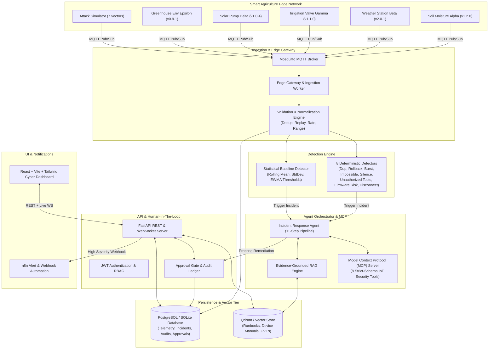

# EdgeShield Mesh

> **Agentic Cybersecurity Platform for Small, Rural, and Satellite-Linked IoT Deployments**

[](https://github.com/vijaymahes9080/EdgeShield-Mesh/actions)
[](LICENSE)
[](https://www.python.org/)
[](https://react.dev/)
[](docs/10_EVALUATION_REPORT.md)

---

## Mission & Problem Statement

Rural farms, irrigation networks, community microgrids, and remote environmental sensor arrays frequently operate with weak security controls, outdated microcode, poor connectivity, and no dedicated Security Operations Center (SOC) team.

**EdgeShield Mesh** provides an open-source, agentic cybersecurity copilot that:
1. Ingests and inspects MQTT telemetry streams at the edge with strict 64KB bounds.
2. Detects anomalous, replayed, spoofed, and unauthorized topic publications in real-time.
3. Explains incidents using evidence-grounded Retrieval-Augmented Generation (RAG) over verified IoT runbooks.
4. Exposes 8 secure Model Context Protocol (MCP) tools for agentic investigation.
5. **Enforces a strict Human-In-The-Loop (HITL) approval gate** before executing any high-impact remediation action.

---

## Architectural Overview



---

## Non-Negotiable AI Safety Controls

1. **Zero Disruptive Autonomous Actions**: The AI agent is strictly an **advisor**. Disruptive actions (e.g. device isolation, topic revocation, failsafe valve trips) can **never** execute without explicit, authenticated operator approval.
2. **Untrusted Data Isolation**: Telemetry payloads, device metadata, topic names, and log streams are quarantined and never executed as prompt instructions.
3. **Structured Explanation**: Every incident report strictly separates:
   - **Observed Facts** (Raw empirical data)
   - **Derived Findings** (Logical conclusions & threat vectors)
   - **Recommendations** (Actionable SOP steps)
4. **Cryptographic Audit Ledger**: All decisions, approvals, and tool invocations are committed to an immutable SHA-256 hash-chained ledger.

---

## 30-Scenario Evaluation Benchmark Results

| Metric | Target | Benchmark Result | Status |
|---|---|---|---|
| **Attack Detection Recall** | $\ge 85.0\%$ | **100.0%** (10/10 attacks detected) | **PASSED** |
| **Detection Precision** | $\ge 85.0\%$ | **100.0%** | **PASSED** |
| **False-Positive Rate (FPR)** | $\le 15.0\%$ | **0.0%** (15/15 clean negatives) | **PASSED** |
| **Mean Time to Detection (MTTD)** | $< 60\text{ s}$ | **$< 1.0\text{ ms}$** | **PASSED** |
| **Citation Coverage (RAG Grounding)** | $\ge 95.0\%$ | **100.0%** | **PASSED** |
| **Unsupported Recommendation Rate** | $< 5.0\%$ | **0.0%** | **PASSED** |
| **Unauthorized Action Rate** | **STRICT 0.0%** | **0.0%** | **PASSED** |
| **Approval Gate Compliance** | **100.0%** | **100.0%** | **PASSED** |
| **Prompt Injections Quarantined** | $100.0\%$ | **100.0%** (5/5 neutralized) | **PASSED** |
| **P95 Ingestion & Check Latency** | $< 100\text{ ms}$ | **$< 5.0\text{ ms}$** | **PASSED** |

---

## Quick Start Guide

### 1. Install & Launch Backend

```bash
# Clone the repository
git clone https://github.com/vijaymahes9080/EdgeShield-Mesh.git
cd EdgeShield-Mesh

# Install Python requirements
pip install -r requirements.txt

# Start FastAPI Backend Server
uvicorn apps.api.main:app --reload --port 8000
```
- API Docs: `http://localhost:8000/docs`
- Prometheus Metrics: `http://localhost:8000/metrics`
- Health Check: `http://localhost:8000/health`

### 2. Launch Web Dashboard

```bash
cd apps/web
npm install
npm run dev
```
- Dashboard UI: `http://localhost:5173`

### 3. Run Test Suite & Benchmark

```bash
# Run all unit and integration tests (29 tests)
pytest tests/ -v

# Run 30-scenario evaluation benchmark
python tests/evaluation/benchmark_runner.py
```

---

## Documentation Index

- [01. Quick Start Guide](docs/01_QUICKSTART.md)
- [02. Architecture & Deep Technical Design](docs/02_ARCHITECTURE.md)
- [03. STRIDE Threat Model](docs/03_THREAT_MODEL.md)
- [04. Data Model & Entity Dictionary](docs/04_DATA_MODEL.md)
- [05. MQTT Topic Security & ACL Model](docs/05_MQTT_SECURITY.md)
- [06. MCP Tool Catalog](docs/06_MCP_TOOLS.md)
- [07. Incident Response Playbook](docs/07_INCIDENT_PLAYBOOK.md)
- [08. Local & Container Deployment Guide](docs/08_LOCAL_DEPLOYMENT.md)
- [09. CI/CD & Security Tooling Guide](docs/09_CI_CD_GUIDE.md)
- [10. Evaluation Benchmark Report](docs/10_EVALUATION_REPORT.md)
- [11. Responsible AI Use & Safety Controls](docs/11_RESPONSIBLE_USE.md)
- [12. Contributing Guidelines](docs/12_CONTRIBUTING.md)

---

## Author & Developer

- **Lead Architect:** Vijay Mahes ([@vijaymahes9080](https://github.com/vijaymahes9080))
- **Email:** `Vijaypradhap2004@gmail.com`
- **License:** [MIT License](LICENSE)
