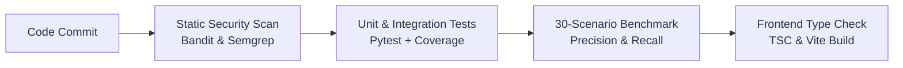

# EdgeShield Mesh — CI/CD & Security Tooling Guide

This document describes the automated continuous integration, testing, and security scanning pipeline configured for EdgeShield Mesh.

---

## 1. GitHub Actions Pipeline Overview

The pipeline runs on every `push` and `pull_request` to `main`:



---

## 2. Security Tooling Integration

- **Bandit**: Python static application security testing (SAST) scanning for unsafe functions, hardcoded secrets, and weak cryptography.
- **pip-audit**: Scans python dependencies against the Python Packaging Advisory Database (PyPA) and OSV.
- **Semgrep Community**: Rule-based code analysis detecting injection and insecure patterns.
- **Trivy**: Container image vulnerability and misconfiguration scanner.

---

## 3. Running Scans Locally

```bash
# Run Bandit SAST
bandit -r packages/ services/ apps/api/ -ll -ii

# Run Pytest suite
pytest tests/ -v --cov=packages --cov=services --cov=apps/api

# Run Evaluation Benchmark
python tests/evaluation/benchmark_runner.py
```
