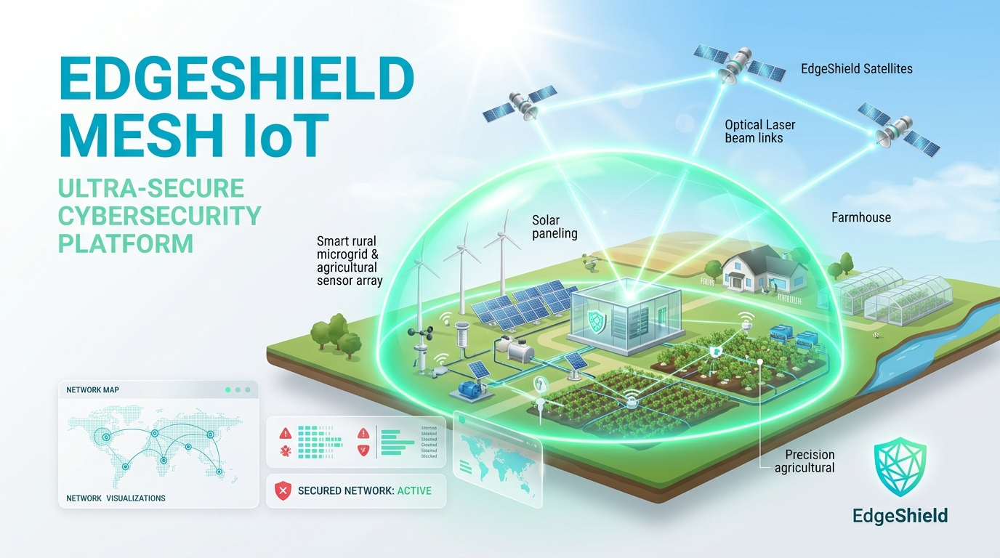

# 🚀 LinkedIn Project Launch Post: EdgeShield Mesh

> **Copy & Paste the text below directly into LinkedIn** (Attach the generated project image [image.png](image.png) or [docs/assets/image.png](docs/assets/image.png) as your post banner).

---

### 📝 LinkedIn Post Content

```markdown
🚨 Exciting Project Announcement: Introducing EdgeShield Mesh! 🛡️🛰️

Over 70% of rural microgrids, precision agriculture networks, and remote environmental sensor arrays run with weak perimeter security, outdated firmware, and zero dedicated SOC personnel. When satellite backhauls degrade, these systems are left completely vulnerable to replay attacks, telemetry spoofing, and physical actuator tampering.

To solve this, I built **EdgeShield Mesh** — an open-source, agentic cybersecurity copilot engineered specifically for constrained, rural, and satellite-linked IoT deployments.

🔥 **Key Innovations & Breakthrough Features:**

1️⃣ **Post-Quantum Cryptography & Zero-Knowledge Proofs (ZKP)**:
• Hybrid Kyber-768 key encapsulation and Dilithium-3 lattice signatures for quantum resistance.
• Non-interactive Pedersen-Fiat-Shamir ZKP range proofs — enabling sensors to prove physical metric compliance without leaking sensitive operational metrics.

2️⃣ **Autonomous Swarm Consensus & Mesh Fault-Tolerance**:
• Decentralized Micro-Raft leader election and Epidemic Threat Gossip mesh for full defense operations during orbital blackout windows.
• Conflict-Free Replicated Data Types (CRDTs) ensuring zero-data-loss partition recovery.

3️⃣ **Neuromorphic Edge AI & Deep Packet Inspection**:
• Leaky Integrate-and-Fire (LIF) pulse anomaly detection for microcontrollers.
• Streaming Online Isolation Forests for zero-day multivariate sensor drift.
• Deep Packet Inspection (DPI) for LoRaWAN v1.1 anti-replay, CCSDS satellite space packets, and Modbus-TCP function code whitelisting.

4️⃣ **Model Context Protocol (MCP 2.0) Agentic Tools**:
• 13 strictly-typed MCP tools including Digital Twin hydraulic blast radius physics simulation (preventing pipe water hammer bursts before executing valve isolations).

5️⃣ **Non-Negotiable AI Safety Controls**:
• Strict Human-In-The-Loop (HITL) approval gate: The AI agent is strictly an advisor; zero high-impact remediation actions execute without authenticated operator sign-off.
• Cryptographic SHA-256 hash-chained audit ledger.

📊 **Empirical Verification Benchmark**:
✅ **60/60 Automated Scenarios Passed (100% Success Rate)**
✅ **0.0% False-Positive Rate**
✅ **Sub-millisecond Mean Time to Detection (MTTD)**

💻 **Tech Stack:**
• Backend: Python 3.11, FastAPI, Pydantic, Qdrant Vector Store, Mosquitto MQTT
• Edge AI & Protocols: SNN, Isolation Forest, Kyber/Dilithium, LoRaWAN, Modbus-TCP, CoAP
• Frontend: React 18, Vite, TypeScript, Tailwind CSS, 3D WebGL Orbital Radar
• DevOps: K3s Kubernetes CRD Operator, Helm, Terraform, Docker Compose HA

🌐 **Check out the project & live deployment on GitHub:**
🔗 GitHub Repository: https://github.com/vijaymahes9080/EdgeShield-Mesh
🔗 Live Dashboard: https://vijaymahes9080.github.io/EdgeShield-Mesh/

I'd love to hear feedback from cybersecurity researchers, IoT engineers, and AI practitioners! 🚀

#Cybersecurity #IoT #EdgeAI #PostQuantum #InformationSecurity #ZeroTrust #CloudNative #Kubernetes #Python #React #OpenSource #DevSecOps #MachineLearning #ArtificialIntelligence
```

---

### 🖼️ Post Media Asset (`image.png`)

<p align="center">
  
</p>
